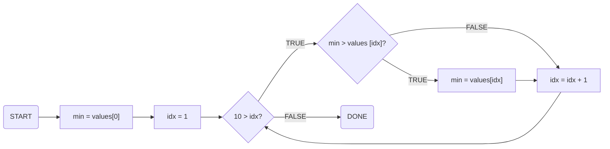

## FSM and Code
Theoretically, finite state machines can solve any kinds of problems that computer language codes can solve. (Because computers are also finite state machines!)

Look at the example code below.

```c
int values[10];
int idx;
int min = values[0];
for (idx = 1; 10 > idx; idx = idx + 1) 
{
	if (min > values[idx])
	{
		min = values[idx];
	} 
}
```

How to transform this code into a finite state machine?

## Code Analysis

### Array -> Memory
What does this mean?
```c
int values[10];
```

We created ten 32-bit 2’s complement numbers (ten ints). Such a group is called an array. An **array** is the software analogue of a **memory**.

### Flow Chart


