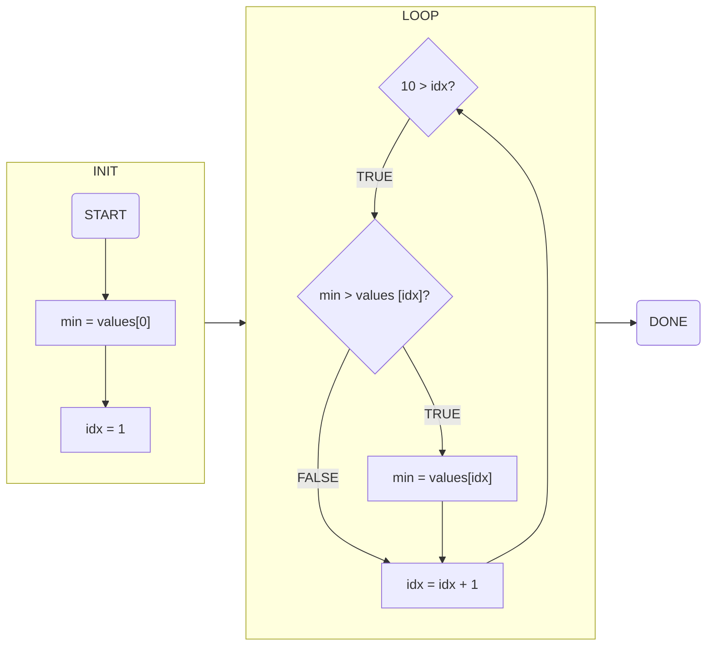
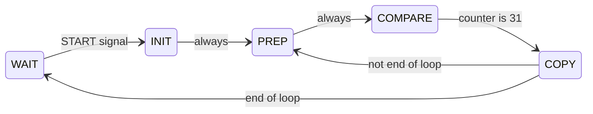

## FSM and Code
Theoretically, finite state machines can solve any kinds of problems that computer language codes can solve. (Because computers are also finite state machines!)

Look at the example code below.

```c
int values[10];
int idx;
int min = values[0];
for (idx = 1; 10 > idx; idx = idx + 1) 
{
	if (min > values[idx])
	{
		min = values[idx];
	} 
}
```

How to transform this code into a finite state machine?

## Code Analysis

### Array -> Memory
What does this mean?
```c
int values[10];
```

We created ten 32-bit 2’s complement numbers (ten ints). Such a group is called an array. An **array** is the software analogue of a **memory**.

### Flow Chart


This is the entire flow chart of the C code. The division of the graph is done according to programming ideas. But in FSM, things won't be so easy, there's no LOOP and IF in FSM. So we need to be more specific.

### Components
1. Array -> Memory
2. Other variables -> registers/ counters
3. The if statement -> a comparator

### Modifying INIT
As a matter of fact, the first time performing `10 > idx` is clearly TRUE. So we don't actually need to compare 10 and idx in the init cycle, the statement could be integrated into INIT.

### Adding WAIT
The FSM circuit should be ready for another use, so START and DONE should be in the same state called WAIT, which means the circuit is ready for a new run.

### Combining COPY
The two following statements:
```c
min = values[idx];
idx = idx + 1;
```

They're actually independent of each other (`min` and `idx` doesn't have to do with each other), so we can do the two operations at the same time. We'll then call this state COPY.

### PREP and COMPARE
Unlike `idx` which is stored in registers, while comparing `values[idx]`, we need to read inputs from a memory and perform a serial comparison.

Therefore, we actually need two states for the if statement `if (min > values[idx])`.

- PREP state:
	- Copies `min` to shift register A
	- Copies `values[idx]` to shift register B
	- Resets the counter to 0.
- COMPARE state:
	- The serial comparator performs the comparison.
	- When the counter has value 31, the FSM moves to the COPY state.

### Abstract State Transition Diagram

## Designing the Datapath
### IDX - Binary Counter
We could use a 4-bit binary counter for `idx` called IDX.

It should have:
- a CNT input to control counting
- a reset input RST
- output of internal states

### Memory VALUES Use IDX as ADDR
VALUES could be a 16×32-bit memory to represent `values`.

Notice that we only read from memory, and we always read `values[idx]`.

So, we could make the memory always read, and connect the IDX counter to ADDR.

### MIN Only Needs to Load VALUES[IDX]
MIN could be a 32-bit register to represent `min`.

Remind that `min` either reads `values[idx]` or keeps its value. So we can:
- Connect VALUES data output to MIN data input.
- Use input LD to indicate whether or not read `values[idx]`

### A and B are Shift Registers
As mentioned earlier, A and B are shift registers.

In PREP, we set A to MIN and B to VALUES[IDX]. So, we wire directly from MIN to A , and from VALUES output to B.

### Use a Binary Counter to Control the Comparator
Finally, we need a counter to drive the serial comparator for 32 cycles. Let’s use a 5-bit binary counter, CNT. 
To reset the counter, use a reset input, RST.
Comparator has an F / “first bit” input. CNT should generate a zero output Z.

### Datapath
This is the datapath of our FSM:
![[lecture_notes/ECE120/images/Pasted image 20220415185351.png]]

#### How does the datapath relate to the FSM?
Not all signals into the datapath are fixed. Remaining input signals to the components in the datapath are called control signals. Control signals are **outputs of the FSM**. 

Using these signals, each state of the FSM causes the elements of the datapath to perform actions associated with the state.

## Designing The FSM
### Outputs and Inputs of FSM
Our datapath has 6 control signals, which are outputs of FSM:
- IDX.RST
- IDX.CNT
- MIN.LD
- A.LD
- B.LD 
- CNT.RST

Our datapath also generates 3 outputs, which are inputs of FSM:
- DONE
- LAST
- THEN

### Register Transfer Language
We’ll use **register transfer language (RTL)** notation to describe the state’s actions on the datapath.

| state   | actions(simultaneous)                    | condition         | next state       |
| ------- | ---------------------------------------- | ----------------- | ---------------- |
| WAIT    | IDX ← 0                                  | START</br> START' | INIT</br>WAIT    |
| INIT    | MIN ← VALUES[IDX]</br>IDX ← IDX+1        | (always)          | PREP             |
| PREP    | A ← MIN</BR> B ← VALUES[IDX]</BR>CNT ← 0 | (always)          | COMPARE          |
| COMPARE | run serial comparator                    | LAST</BR>LAST'    | COPY</BR>COMPARE |
| COPY    | THEN:MIN ← VALUES[IDX]</BR>IDX ← IDX+1   | DONE</BR>DONE'    | WAIT</BR>PREP    | 

### One-Hot Encoding
We'll use 5 bits instead of 3 bits to store states here, this encoding is called **one-hot encoding**.

### Output Table

| state   | $S_{4}S_{3}S_{2}S_{1}S_{0}$ | IDX.RST | IDX.CNT | MIN.LD | A.LD | B.LD | CNT.RST |
| ------- | --------------------------- | ------- | ------- | ------ | ---- | ---- | ------- |
| WAIT    | 10000                       | 1       | 0       | 0      | 0    | 0    | 0       |
| INIT    | 01000                       | 0       | 1       | 1      | 0    | 0    | 0       |
| PREP    | 00100                       | 0       | 0       | 0      | 1    | 1    | 1       |
| COMPARE | 00010                       | 0       | 0       | 0      | 0    | 0    | 0       |
| COPY    | 00001                       | 0       | 1       | THEN   | 0    | 0    | 0       | 

Due to one-hot encoding, expressing outputs will be quite easy:
$$

\begin{align*}
&IDX.RST = S_{4}\\
& IDX.CNT = S_{3} + S_{0}\\
& MIN.LD = S_{3} + THEN · S_{0} \\
&(\text{others}) = S_{2}
\end{align*}
$$

### Next-State
As a matter of fact, another benefit of one-hot encoding is an easier way to express next-state expressions.

$$
\begin{align*}
&S_{4}^{+}=S_{4}·START'+S_{0}·DONE\\
&S_{3}^{+}=S_{4}·START\\
&S_{2}^{+}=S_{3}+S_{0}·DONE'\\
&S_{1}^{+}=S_{2}+S_{1}·LAST'\\
&S_{0}^{+}=S_{1}·LAST
\end{align*}
$$
