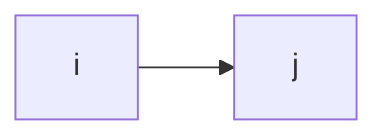

## The von Neumann Model
In 1946, _John von Neumann_ invented a model for computer organization in which a computer comprises five parts.

- Memory
- Processing Unit
- Input
- Output
- Control Unit

### Memory
The computer’s instructions (program) are stored in the **memory**.

The memory uses two registers to manage data: 
- The **Memory Address Register** (MAR) holds the address on which the memory operates (to read or to write). 
- The **Memory Data Register** (MDR) holds the bits read from the memory, or the bits to write to the memory.

### Processing Unit
A computer also contains a **processing unit**, which performs all operations. and defines the word size for the computer, the number of bits used in most computations.

The Processing Unit includes an ALU and a register file:
- **Arithmetic Logic Unit** (ALU) to handle the operations.
- a **register file** for temporary storage of values, which is fast but small.

### Input and Output
A computer also needs the ability to get input from outside, and to deliver results to the external world. The von Neumann model includes both input and output.

### Control Unit
The control unit (an FSM) uses two registers: 
- **The Program Counter** (PC) holds the address of the next instruction. 
- **The Instruction Register** (IR) holds the bits of the current instruction.

### Diagram

## LC-3 as a von Neumann Machine
The Little Computer-3 (LC-3) ISA is an educational tool.

